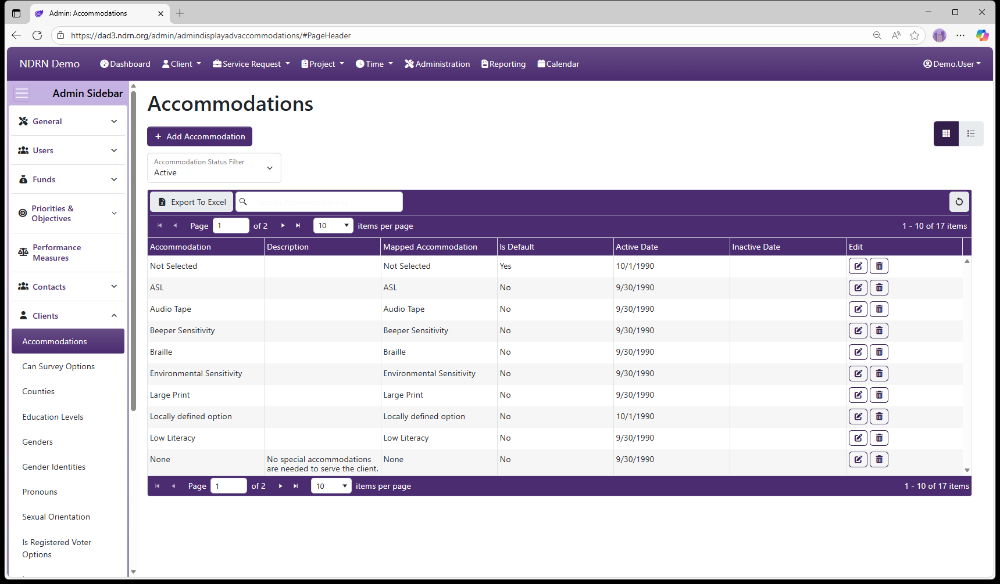

[Home](../../index.md) / [Configuration Reference](../index.md) / [Section: Clients](index.md) / Accommodations

# Accommodations

**Page Type:** Table (URL: [https://dad3.ndrn.org/admin/admindisplayadvaccommodations](https://dad3.ndrn.org/admin/admindisplayadvaccommodations)) <!--style: Subtitle -->


Accommodations options are displayed in a multi-select checklist in the Client record, to track Client accommodation needs. This field is **not** used for reporting purposes.

While mappings are present for the default set of Accommodations, agencies are encouraged to add, inactive, and modify the options in this list as needed.

```admonish tip
Use the **Locally defined option** mapping when adding new Accommodations.
```



## Accommodations Form

Options: Is the Default Option


[← Previous: Section: Clients](index.md) | [Next: Can Survey Options →](can-survey-options.md)
