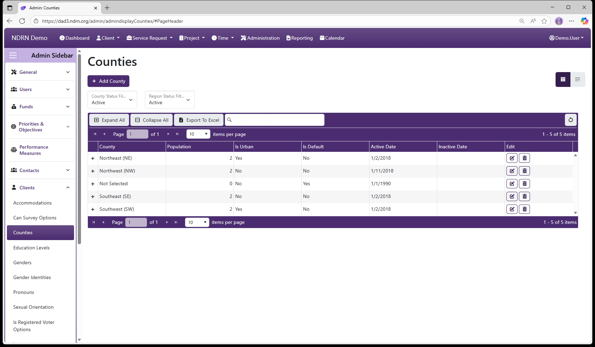
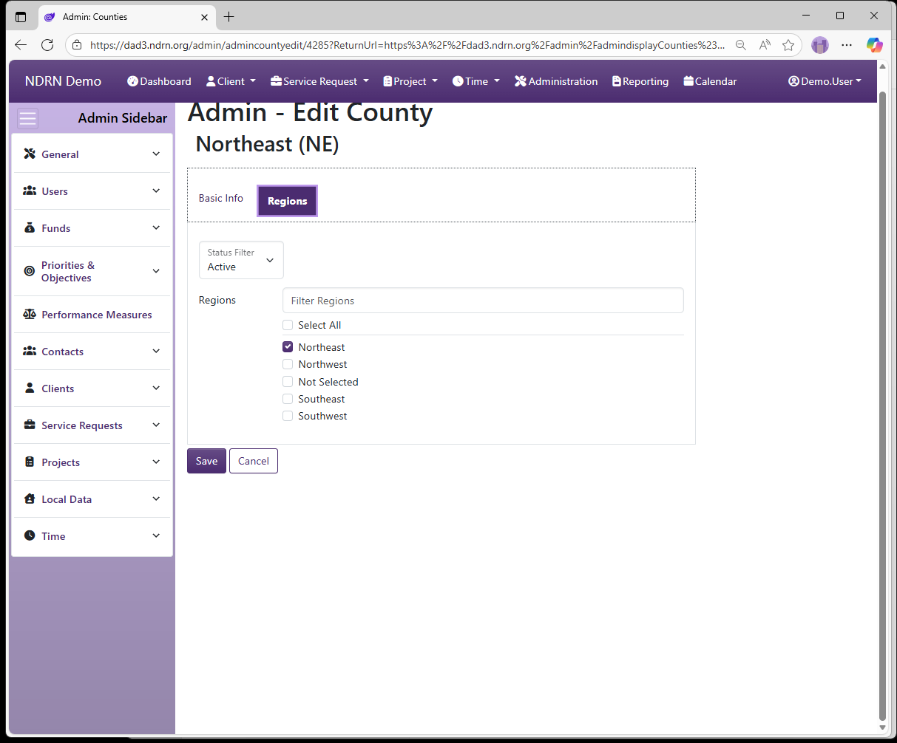

[Home](../../index.md) / [Configuration Reference](../index.md) / [Section: Clients](index.md) / Counties

# Counties

**Page Type:** Table (URL: [https://dad3.ndrn.org/admin/admindisplayCounties](https://dad3.ndrn.org/admin/admindisplayCounties)) <!--style: Subtitle -->

**Associated Record Types:** [Regions](../section-service-requests/regions.md)

**Counties** contain the list of counties served by your Advocacy Group. County is tracked in both Client and Service Request records. Optionally, counties can be associated with [Regions](../section-service-requests/regions.md).

## Counties Form

### Basic Info Tab

Options: Is Urban, Is the Default Option

### Regions Tab

Select the Region(s) associated with this County. 

[← Previous: Can Survey Options](can-survey-options.md) | [Next: Education Levels →](education-levels.md)
