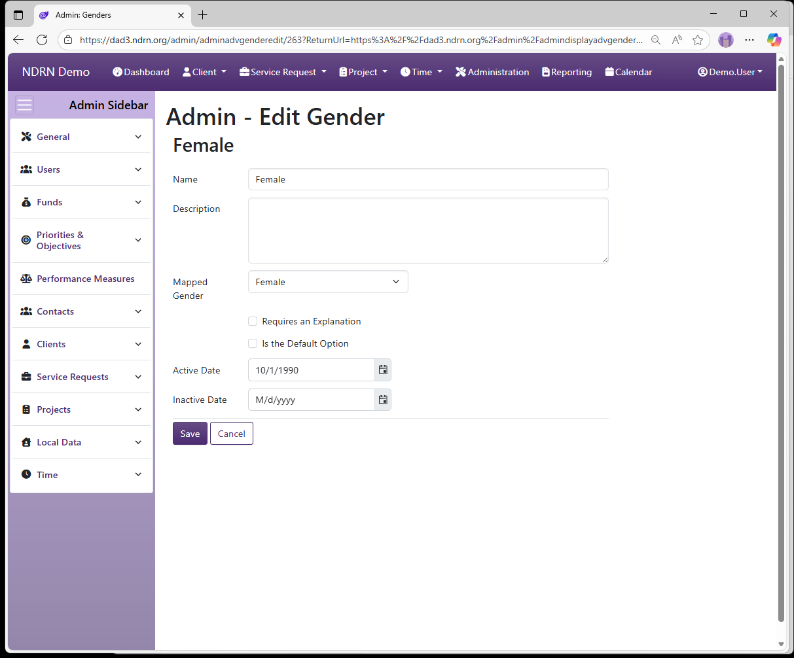

[Home](../../index.md) / [Configuration Reference](../index.md) / [Section: Clients](index.md) / Genders

# Genders

**Page Type:** Table (URL: [https://dad3.ndrn.org/admin/admindisplayadvgenders](https://dad3.ndrn.org/admin/admindisplayadvgenders)) <!--style: Subtitle -->

**Genders** are options used to record a Client's Gender for reporting purposes. **Mapped Gender** selections reflect the federally reportable options.

```admonish tip
Because reporting requirements have changed frequently in recent years, there may be mapped options that are no longer collected for all funding sources. To ensure that your settings are aligned with current PPR data collection requirements, email DADsupport@ndrn.org to request the most current version of the DAD PPR Settings Reference (Excel workbook format).
```


## Genders Form

Options: Requires an Explanation, Is the Default Option



[← Previous: Education Levels](education-levels.md) | [Next: Gender Identities →](gender-identities.md)
