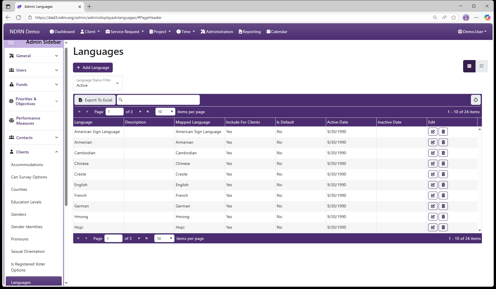

[Home](../../index.md) / [Configuration Reference](../index.md) / [Section: Clients](index.md) / Languages

# Languages

**Page Type:** Table (URL: [https://dad3.ndrn.org/admin/admindisplayadvlanguages](https://dad3.ndrn.org/admin/admindisplayadvlanguages)) <!--style: Subtitle -->

Languages are dropdown options used to record both the language use by Clients and in Publications. For a language to appear for Client records, the **Include for Clients** option must be selected. This field is **not** used for reporting purposes.

## Languages Form

Options: Include for Clients, Is the Default Option

[← Previous: Is Registered Voter Options](is-registered-voter-options.md) | [Next: On Mailing List Options →](on-mailing-list-options.md)
