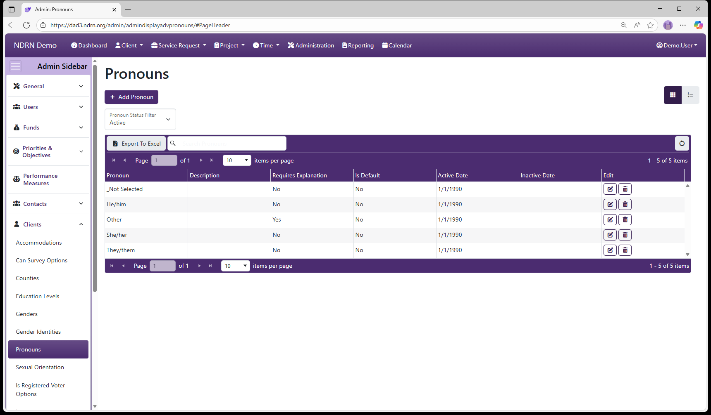

[Home](../../index.md) / [Configuration Reference](../index.md) / [Section: Clients](index.md) / Pronouns

# Pronouns

**Page Type:** Table (URL: [https://dad3.ndrn.org/admin/admindisplayadvpronouns](https://dad3.ndrn.org/admin/admindisplayadvpronouns)) <!--style: Subtitle -->

**Pronouns** options are displayed in a dropdown in the Client record, to record a client's preferred pronouns. This field is **not** used for reporting purposes.

## Pronouns Form

Options: Requires an Explanation, Is the Default Option

[← Previous: Gender Identities](gender-identities.md) | [Next: Sexual Orientation →](sexual-orientation.md)
