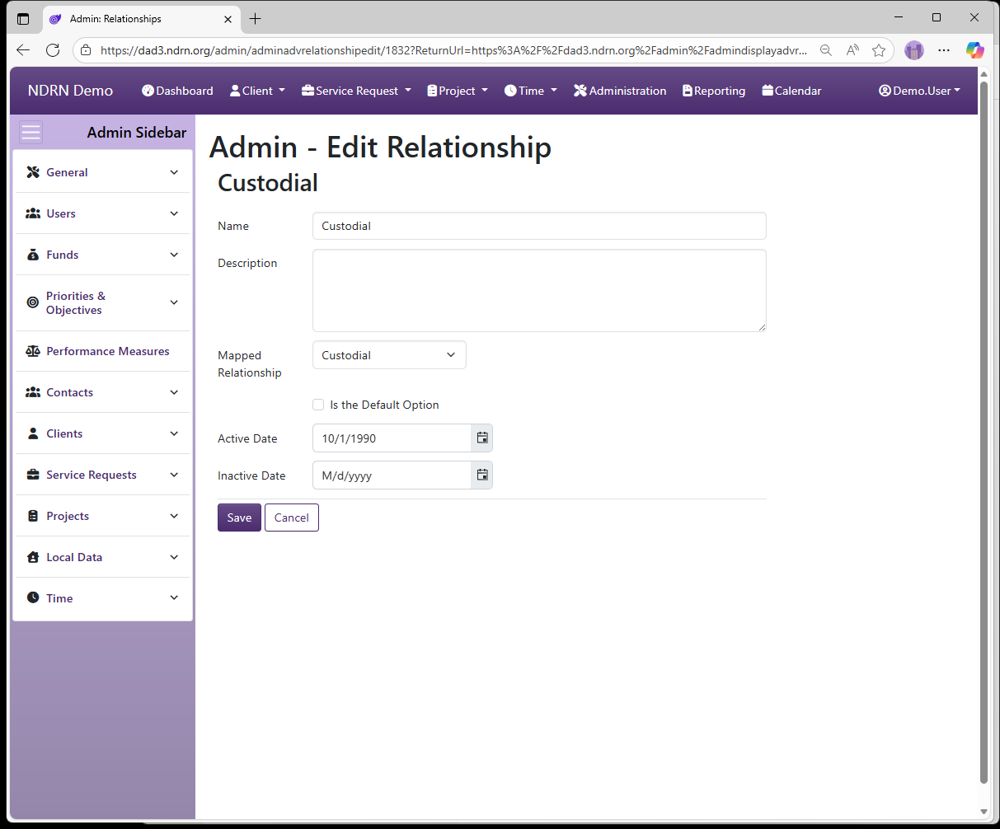

[Home](../../index.md) / [Configuration Reference](../index.md) / [Section: Contacts](index.md) / Relationships

# Relationships

**Page Type:** Table (URL: [https://dad3.ndrn.org/admin/admindisplayadvrelationships](https://dad3.ndrn.org/admin/admindisplayadvrelationships)) <!--style: Subtitle -->

**Relationships** populate a dropdown that provides further information about a Contact, and is displayed (in addition to Contact Type) in the Contact list/grid display in Clients, Service Requests and Projects, as well as in Connections that can be displayed for the results of Contact Searches. Agencies are encouraged to populate this list with options that are meaningful in the context of intake, conflict checking and case handling.

## Relationships Form

Options: Is the Default Option

[← Previous: Organization Types](organization-types.md) | [Next: Zip Codes →](zip-codes.md)
