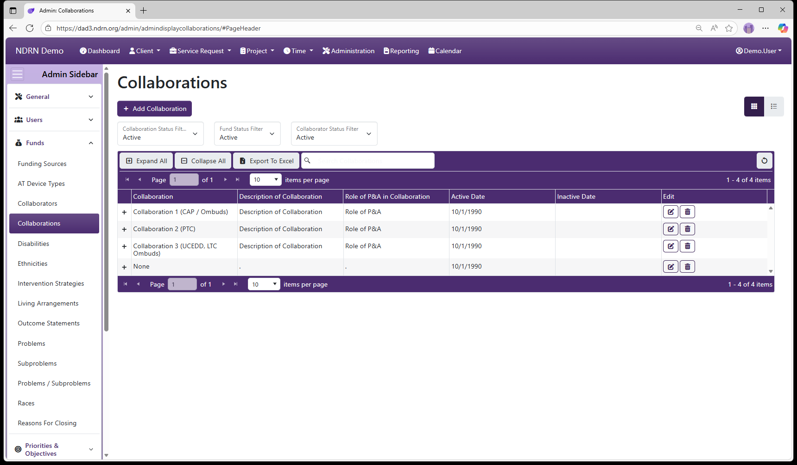
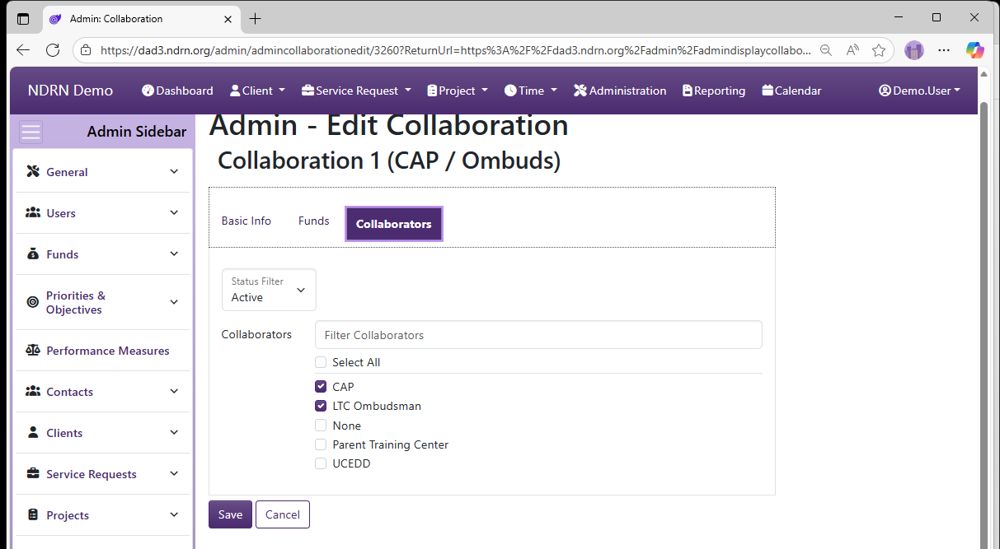

[Home](../../index.md) / [Configuration Reference](../index.md) / [Section: Funds](index.md) / Collaborations

# Collaborations

**Page Type:** Table (URL: [https://dad3.ndrn.org/admin/admindisplaycollaborations](https://dad3.ndrn.org/admin/admindisplaycollaborations)) <!--style: Subtitle -->

Collaborators and Collaborations are used in DAD to track activities involving collaboration with other agencies and entities. The OnePPR requires reporting on these collaborations, including details on collaboration with certain types of entities (reflected in the Mapped Collaborators selections). Project records can have one or more Collaborations selected - options are determined based on Funding Source. Each Collaboration can consist of one or more Collaborators.

Collaborators and Collaborations can be entered and maintained by a DAD Administrator **or** by a User with the **Edit: Collaborations** permission granted.

Collaborations are entered on this page, and can be associated with exisitng Collaborations and existing Funding Sources.

Operations available on this page include: 
- **Add Collaboration** button to add a new entry
- **Edit** and **Delete** buttons for exisiting entries
- **Expand All** and **Collapse All** buttons to show or hide Associated Collaborators and Funding Sources, and
- **Export to Excel** button to export these settings to a file

**Associated Record Types:** [Collaborators](collaborators.md), [Funding Sources](funding-sources.md)

## Collaborations Form

### Basic Info Tab

- **Name** Display name of the option (Short Text - required)

- **Description of Collaboration** This field corresponds to information that must be provided for each Collaboration in the OnePPR. (Long Text - required)

- **Role of P&A in Collaboration** This field corresponds to information that must be provided for each Collaboration in the OnePPR. (Long Text - required)

- **Active Date** The option will appear as an option for records with a Reference Date that is between the Active Date and Inactive Date. (Required)

- **Inactive Date** The option will appear as an option for records with a Reference Date that is between the Active Date and Inactive Date. (Optional)

### Collaborators Tab

Select one or more Collaborators for this Collaboration.

### Funds Tab

Select one or more Funding Sources for this Collaboration.

[← Previous: Collaborators](collaborators.md) | [Next: Disabilities →](disabilities.md)
