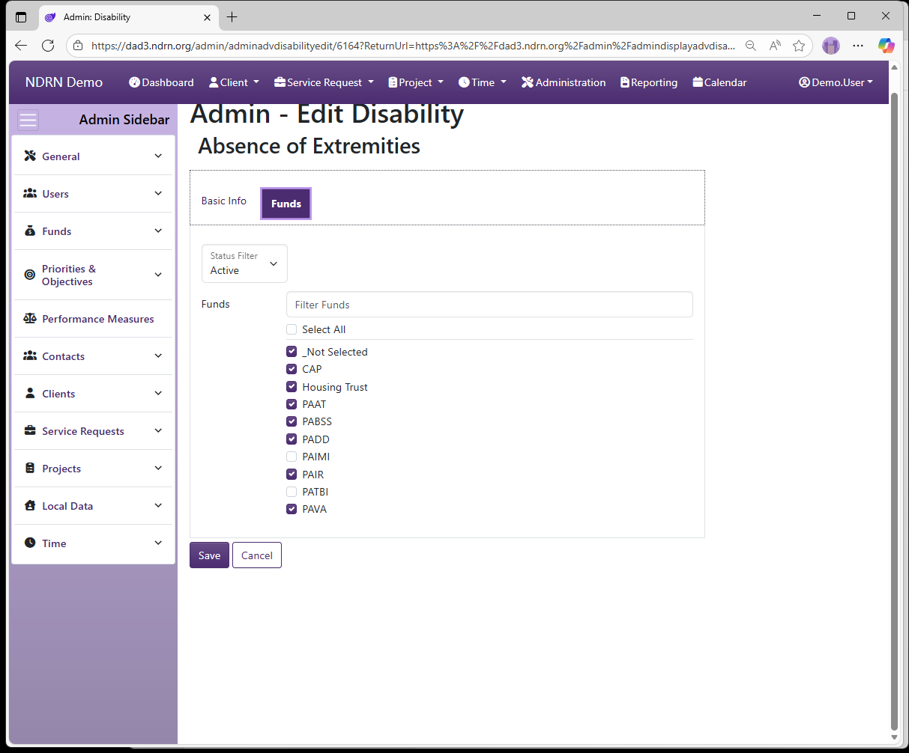

[Home](../../index.md) / [Configuration Reference](../index.md) / [Section: Funds](index.md) / Disabilities

# Disabilities

**Page Type:** Table (URL: [https://dad3.ndrn.org/admin/admindisplayadvdisabilities](https://dad3.ndrn.org/admin/admindisplayadvdisabilities)) <!--style: Subtitle -->

_Has Field Mapping_ / **Associated Record Types:** [Funding Sources](funding-sources.md)

Disabilities are options used to track a Client Disabilities for eligibility determination and reporting purposes. **Mapped Disability** selections reflect the federally reportable options for all funding sources. Agencies may modify Disability selections that end users see and add additional Disabilities if desired. For accurate reporting, each mapped Disability must have at least one active selection mapped to it.

In the Client Record, multiple Disabilities can be selected from a checklist. In a Service Request Record, only Disabilities that were selected for the Client are are associated with the funding source for a Service Request will be available for selection as the "Primary Disability" for that record.

## Disabilities Form

### Basic Info Tab

Options: Requires Further Description, Can Be Copied Back To The Client When Selected As Primary, Is the Default Option, Local Labels

- **Name** Display name of the option (Short Text - required)

- **Description** This field is for agency use. (Long Text - optional)

- **Mapped Disability** Selections are based on PPR categories.

- **Requires Further Description** This box should be checked to require additional text description when selected. (Checkbox)

- **Is the Default Option** This box should be checked for the "Not Selected" option. (Checkbox)

- **Active Date** The option will appear as an option for records with a Reference Date that is between the Active Date and Inactive Date. (Required)

- **Inactive Date** The option will appear as an option for records with a Reference Date that is between the Active Date and Inactive Date. (Optional)

- **Local Label 1** and **Local Label 2** Local Labels can be used to define categories and/or alternate terms for each option. Local Labels can then be accessed using the Report Generator.

### Funds Tab

Select one or more Funding Sources for this Disability.

[← Previous: Collaborations](collaborations.md) | [Next: Ethnicities →](ethnicities.md)
