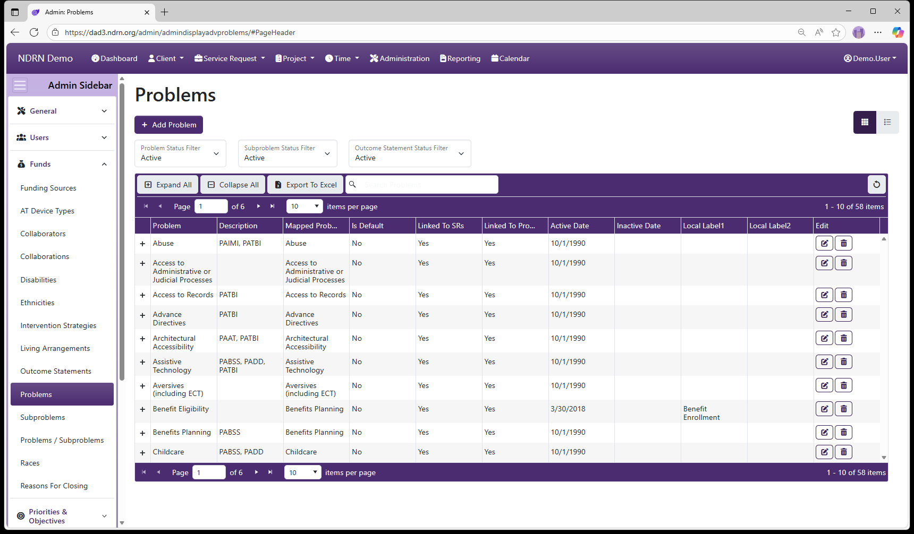

[Home](../../index.md) / [Configuration Reference](../index.md) / [Section: Funds](index.md) / Problems

# Problems

**Page Type:** Table (URL: [https://dad3.ndrn.org/admin/admindisplayadvproblems](https://dad3.ndrn.org/admin/admindisplayadvproblems)) <!--style: Subtitle -->

_Has Field Mapping_ / **Associated Record Types:** [Subproblems](subproblems.md), [Outcome Statements](outcome-statements.md)

**Problems** are used in conjunction with **Subproblems** to categorize both cases and projects, for federal reporting purposes. **Mapped Problem** selections reflect the federally reportable options for all P&A funding sources. Agencies may modify the text of the Problem selections that end users see if desired.

Problems are not associated directly with Funding Sources. They are associated with one or more Subproblems, and each Problem/Subproblem pair is then associated with Funding Sources.

## Problems Form

### Basic Info Tab

Options: Is the Default Option, Use with Service Requests, Use with Projects, Local Labels

Local Label 1 and Local Label 2 can be used to apply alternative names to Problems for use with the Report Generator.

### Subproblems Tab

Under some funding sources (e.g. PAIR, CAP), subproblems are not reported. In those cases, the Problem is associated with a single Subproblem for that Funding Source (usually with the same label as the Problem, though agency setups vary).

When a Problem has *multiple* Suproblem selections for a Funding Source, the Problem should be associated with the default Subproblem (e.g. Not Selected), and that "Problem/Not Selected" pair should then be associated with that Funding Source. This allows the Subproblem dropdown selection to function correctly.

### Outcome Statements Tab

Historically, reportable Outcomes Statements differed depending on the case Problem Area. Because federal reporting reqirements have since changed, it is no longer necessary to restrict selections based on Problem. Simply **Select All** when associating **Problems** with **Outcome Statements**.

[← Previous: Outcome Statements](outcome-statements.md) | [Next: Subproblems →](subproblems.md)
