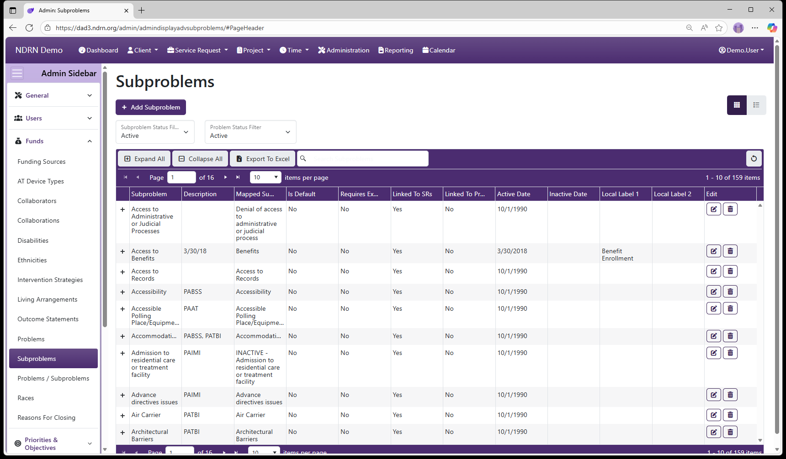

[Home](../../index.md) / [Configuration Reference](../index.md) / [Section: Funds](index.md) / Subproblems

# Subproblems

**Page Type:** Table (URL: [https://dad3.ndrn.org/admin/admindisplayadvsubproblems](https://dad3.ndrn.org/admin/admindisplayadvsubproblems)) <!--style: Subtitle -->

**Subproblems** are used in conjunction with **Problems** to categorize cases and projects, for federal reporting purposes. **Mapped Subproblem** selections reflect the federally reportable options for all P&A funding sources. Agencies may modify the text of the Subproblem selections that end users see if desired.

Subproblems are not associated directly with Funding Sources. They are associated with one or more Problems, and each Problem/Subproblem pair is then associated with Funding Sources.


_Has Field Mapping_ / **Associated Record Type:** [Problems](problems.md)




## Subproblems Form

### Basic Info Tab

Options: Is the Default Option, Use with Service Requests, Use with Projects, Local Labels

```admonish tip
The default (e.g. "Not Selected") subproblem should **not** be used with Projects
```


### Problems Tab


[← Previous: Problems](problems.md) | [Next: Problems / Subproblems →](problems-subproblems.md)
