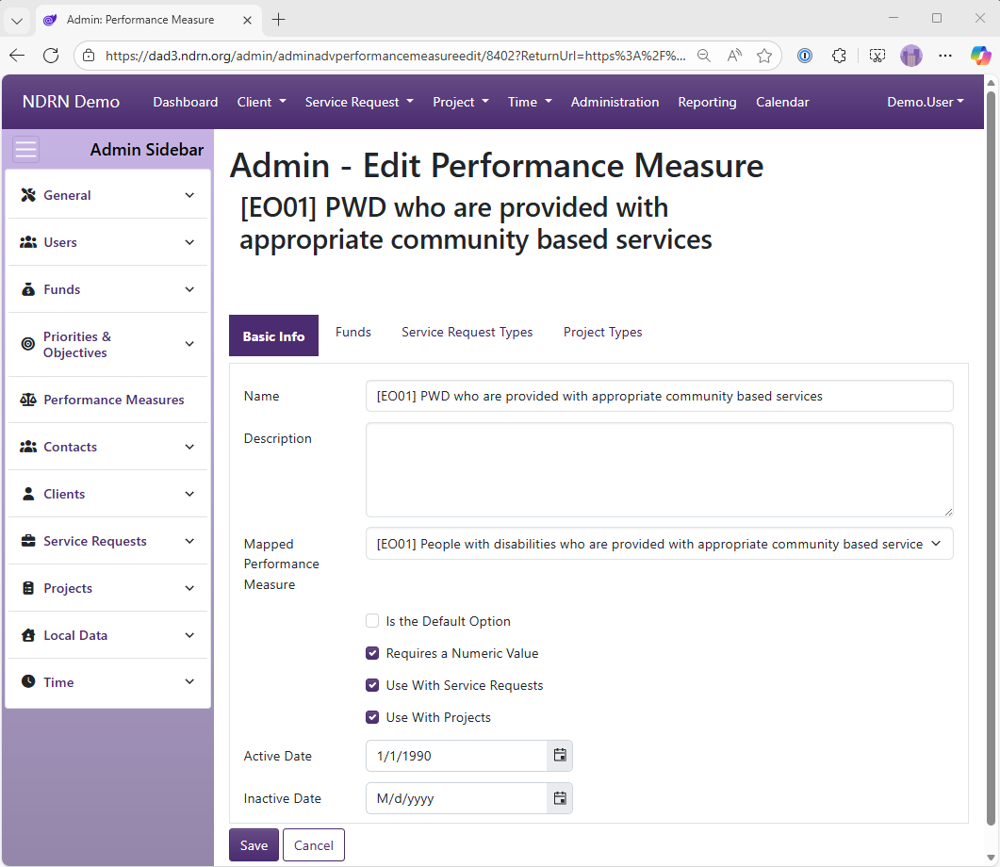
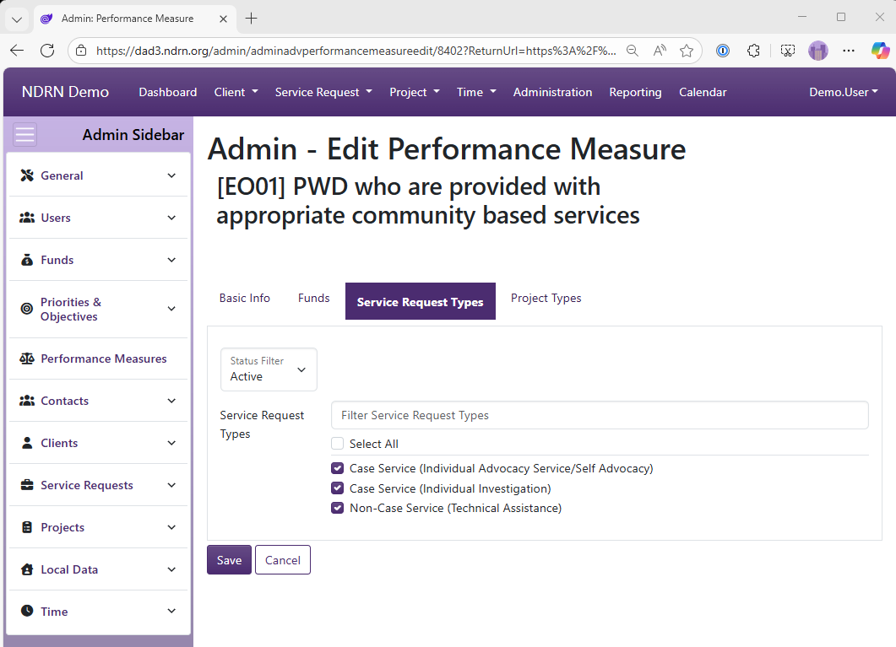

[Home](../../index.md) / [Configuration Reference](../index.md) / [Section: Performance Measures](index.md)

# Section: Performance Measures

***Page Type:** Table* <!-- style: Subtitle -->

_Has Field Mapping_ / **Associated Record Types:** [Funding Sources](../section-funds/funding-sources.md) (Funds), [Service Request Types](../section-service-requests/service-request-types.md) (Service Requests), [Project Types](../section-projects/project-types.md) (Projects)

Performance Measures were iniitally added to DAD to facilate PPR data collection for the OnePPR funding sources (PADD, PAAT, PATBI, PAVA). They have since been expanded for use with PAIMI PPR data collection, and they can optionally be configured for use with other funding sources if agencies wish to track similar measures agency-wide.

Performance Measures are displayed when a case or project is Prepared for Closing. At leaset one Performance Measure must be selected to close a record with a OnePPR funding source. Most Performance Measures describe a measurable quantity and require a numerical value to be entered if selected.

```admonish tip
To ensure that your Performance Measure settings are aligned with current PPR data collection requirements, email [DADsupport@ndrn.org](mailto:dadsupport@ndrn.org) to request the most current version of the DAD PPR Settings Reference (Excel workbook format).
```


## Performance Measures Form

### Basic Info Tab

Options: Is the Default Option, Requires a Numeric Value, Use with Service Requests, Use With Projects



### Funds Tab
Select Funding Sources for this Performance Measure.


### Service Request Types Tab
Select Service Request Types for this Performance Measure.


### Project Types Tab
Select Project Types for this Performance Measure.


[← Previous: Priorities & Objectives / Actions](../section-priorities-objectives/actions.md) | [Next: Section: Contacts →](../section-contacts/index.md)
