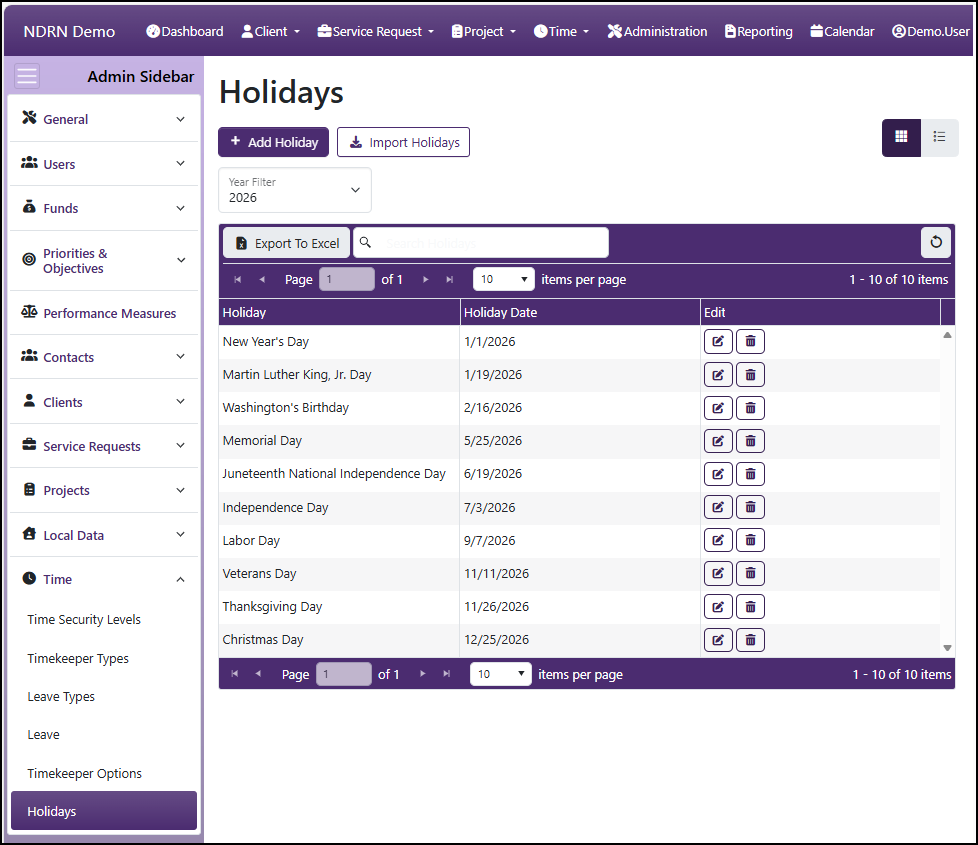
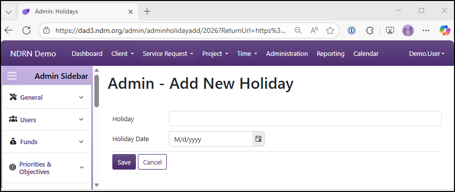

[Home](../../index.md) / [Configuration Reference](../index.md) / [Section: Time](index.md) / Holidays

# Holidays

**Page Type:** Table (URL: [https://dad3.ndrn.org/admin/admindisplayholidays](https://dad3.ndrn.org/admin/admindisplayholidays)) <!--style: Subtitle -->

Holiday entries are used to calculate the **Total holidays this period** in the Baseline Statsitcs displayed on a timesheet. Commonly used holidays can be imported for a year by selecting that year from the **Year** filter, and clicking the **Import Holidays** button. From there, entries can be added, edited, and deleted to align with agency Holidays.

## Holiday Form
Enter or edit Holiday Name and a date.

[← Previous: Timekeeper Options](timekeeper-options.md) | [Next: Appendix →](../../appendix/index.md)
