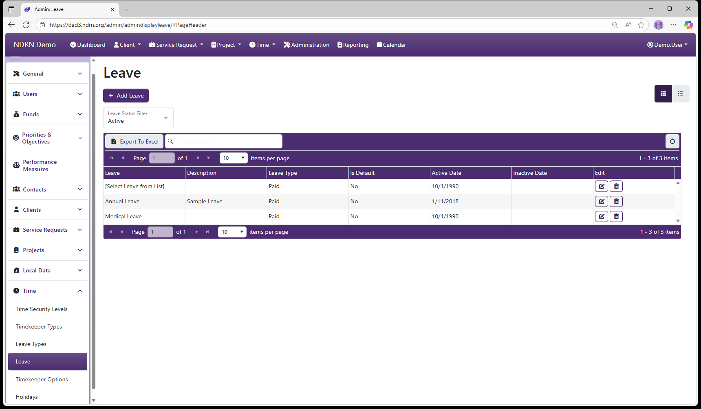
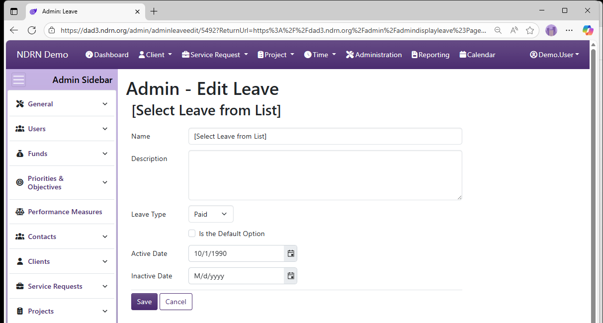

[Home](../../index.md) / [Configuration Reference](../index.md) / [Section: Time](index.md) / Leave

# Leave

**Page Type:** Table (URL: [https://dad3.ndrn.org/admin/admindisplayleave](https://dad3.ndrn.org/admin/admindisplayleave)) <!--style: Subtitle -->

Agencies specify the types of Leave that users can record. A [Leave Type](leave.md) is selected for each Leave entry. Each Leave selection specified here will have its own column in the **Labor Distribution Report** that is commonly used for accounting/finance purposes.

## Leave Form

Options: Leave Type, Is the Default Option

[← Previous: Leave Types](leave-types.md) | [Next: Timekeeper Options →](timekeeper-options.md)
