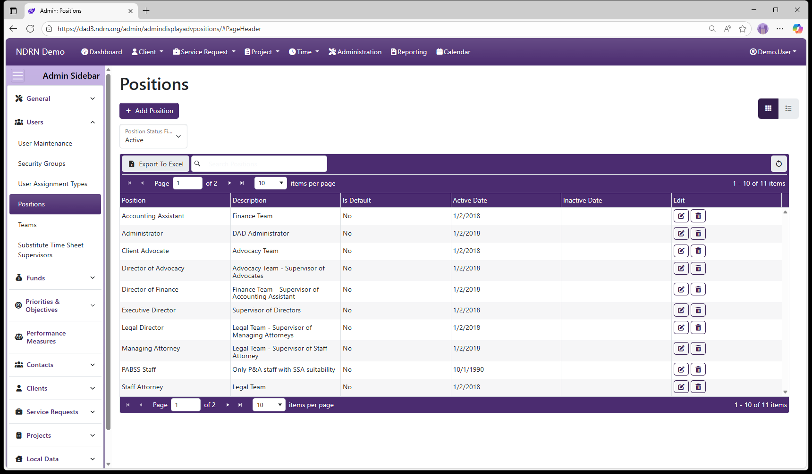

[Home](../../index.md) / [Configuration Reference](../index.md) / [Section: Users](index.md) / Positions

# Positions

**Page Type:** Table (URL: [https://dad3.ndrn.org/admin/admindisplayadvpositions](https://dad3.ndrn.org/admin/admindisplayadvpositions)) <!--style: Subtitle -->

Positions are agency-defined options for User records. Position information for a User can be accessed with the Report Generator, making it a useful field for organizing and managing an agency's users.

As with most DAD Administration settings pages of this type, operations include: **Add Position** button to add a new entry, **Edit** and **Delete** buttons for exisiting entries, and **Export to Excel** button to export the settings to a file.

This screenshot contains examples of position names agencies might use:

## Positions Form

- **Name** Display name of the Position (Short Text - required)

- **Description** This field is for agency use. (Long Text - optional)

- **Is the Default Option** If this box is checked, this Position will be selected by default for new Users. (Checkbox)

- **Active Date** The Position will appear as an option between the Active Date and Inactive Date. (Required)

- **Inactive Date** The Position will appear as an option between the Active Date and Inactive Date. (Optional)

[← Previous: User Assignment Types](user-assignment-types.md) | [Next: Teams →](teams.md)
