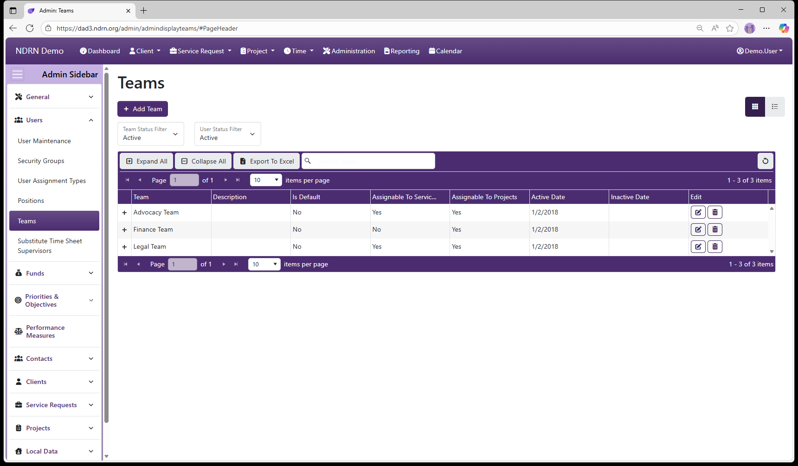
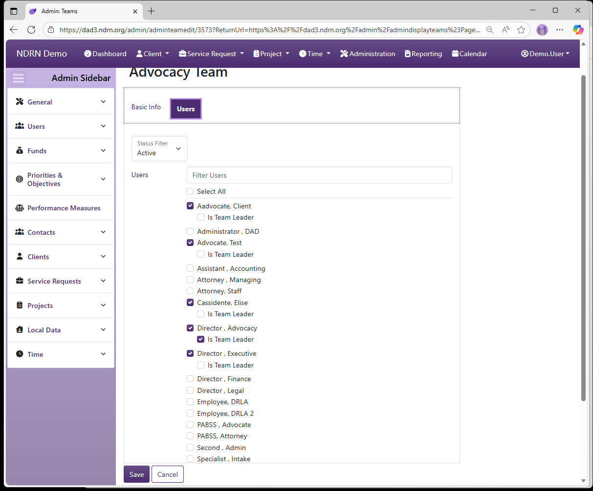

[Home](../../index.md) / [Configuration Reference](../index.md) / [Section: Users](index.md) / Teams

# Teams
**Page Type:** Table (URL: [https://dad3.ndrn.org/admin/admindisplayteams](https://dad3.ndrn.org/admin/admindisplayteams)) <!--style: Subtitle -->

**Associated Record Type:** [Users](index.md)

Teams are agency-defined selections. Each project and service request must be assigned to one or more Teams. Each User can be assigned to (associated with) one or more Teams, either in the **User Maintenence** form or in the **Teams** form below.

Teams are used in various lists/views of Service Requests and Projects. Users can view records that are assigned to their Team. Additionally, Service Request and Project **View (Own)** and **Edit (Own)** permissions are also granted for all records assigned to the User's **Team**, _not_ just the individual User. For this reason, assigning Users to Teams can be used as a way to manage record permissions.

Operations available on this page include: Add Team button to add a new entry, Edit and Delete buttons for exisiting entries, Expand All and Collapse All buttons to show or hide Associated Users, and an Export to Excel button to export the settings to a file. 

```admonish tip
To export the Users for each Team, they must be displayed as a column. Before exporting, edit the Columns settings and select **Users** for display.
```

This screenshot contains some examples of Teams:



## Teams Form

### Basic Info Tab


- **Name** Display name of the Team (Short Text - required)

- **Description** This field is for agency use. (Long Text - optional)

- **Is the Default Option** If this box is checked, this Team will be selected by default for new records. (Checkbox)

- **Assignable to Service Requests** If this box is checked, this Team will appear as an option in Service Request records.

- **Assignable to Projects** If this box is checked, this Team will appear as an option in Project records.

- **Active Date** The Team will appear as an option between the Active Date and Inactive Date. (Required)

- **Inactive Date** The Team will appear as an option between the Active Date and Inactive Date. (Optional)

### Users Tab

This tab contains a list of Users (filtered by Active Users by default). The "Filter Users" text box can be used to narrow down the list (start typing the user name). Check all Users assigned to the Team, and check **Is Team Leader** for any user needing to utilize a permission involving "Team Leader Access"..



[← Previous: Positions](positions.md) | [Next: Substitute Time Sheet Supervisors →](substitute-time-sheet-supervisors.md)
