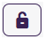

[Home](../../index.md) / [Configuration Reference](../index.md) / [Section: Users](index.md) / User Maintenance

# User Maintenance

**Page Type:** Table/Utility (URL: [https://dad3.ndrn.org/admin/admindisplayusers](https://dad3.ndrn.org/admin/admindisplayusers))

## Associated Record Types

- [Disabilities](../section-funds/disabilities.md) (Funds section)
- [Security Groups](security-groups.md)
- [Teams](teams.md)
- [Regions](../section-service-requests/regions.md) (Service Requests section)


---
## Operations

### Add New User 


To add a new user to the system, click the **Add User** button at the top of the page. The **Add New User** form will appear.

- At a minimum, **First Name**, **Last Name**, **User Name**, and **Password** must be entered in **Tab 1: Basic Info**. The **Active Date** should be set to the first day that the new user should be able to log in to DAD, and it can be set to a future date if desired.
- To complete a new User setup successfully, **Security Groups** must be assigned to the new user (**Tab 4: Security Groups**).
- Agencies using Timekeeping functions must configure the new user’s settings in **Tab 2: Timekeeping**.
- Agencies using Regions and/or Teams should configure these settings in **Tab 5: Teams** and **Tab 6: Regions**.
- Agencies using DAD to track employee demographic information can optionally enter this information in **Tab 1: Basic Info** and **Tab 3: Disabilities**.

### Edit User 


To edit an existing User record, select the **Edit User** button (displayed as a pencil and paper icon in the **Edit** column of the Users grid). The **Edit User** form will appear. The layout is almost identical to the **Add New User** form, but:

- It does **not** have a **Password** field (changing a user password is a separate action instead).
- There are additional fields related to account activity.

### Delete User 


To delete an existing User record, select the **Delete User** button (displayed as a trashcan icon in the **Edit** column of the Users grid). Agency policies should define when to deactivate versus delete a user account. In most cases, a user account cannot be deleted because it is referenced by other records in the database.

### Change Password 


To change an existing User's password, select the **Change Password** button (displayed as a key icon in the **Edit** column of the Users grid). 

### Unlock Account 


To unlock a user’s account after too many failed login attempts, select the **Unlock Account** button (displayed as an unlocked padlock icon in the **Edit** column of the Users grid).

```admonish note
In DAD 3.0, a user's account will unlock automatically after 5 minutes when locked due to failed login attempts.
```

### Reset 2FA 



Use this operation to reset a user’s two-factor authentication (2FA) configuration so they can re-enroll their device. 

```admonish note
In DAD 3.0 users can reset their own 2FA under [Manage your Acccount settings](https://dad3.ndrn.org/Account/Manage/TwoFactorAuthentication) if they are able to log in to their account, or through use of the recoevery codes that are generated when setting up their authenicator.
```

---
## User Form Layout and Contents

### User Form Tab 1: Basic Info


- **First Name** (Short Text - required)
    Enter the user's first name as it should display in DAD records. If a user has a different name for timesheet/payroll purposes, you can spacify this in Tab: 2 Timekeeping, **Time Sheet First Name**.

- **Last Name** (Short Text - required)
    Enter the user's last name as it should display in DAD records. If a user has a different name for timesheet/payroll purposes, you can spacify this in Tab: 2 Timekeeping, **Time Sheet Last Name**.

- **User Number** (Short Text - optional/agency defined)

     Agencies can use this field to align Employee records with their other systems if desired.

- **Advocacy Location** (Dropdown selection)

     This dropdown is populated with active Advocacy Locations (see [Administration > General > Advocacy Locations](../section-general/advocacy-locations.md)).

- **Position** (Dropdown selection)

     This dropdown is populated with active Positions (see [Administration > Users > Positions](../section-users/positions.md)).

- **Home Phone, Work Phone, and Alternate Phone** (Short Text - optional)

- **Email**

     It is highly recommended to enter the user’s valid email address in this field. Without an email address, it is not possible for a user to recover their account with **Forgot my Password** or receive notifications related to Timesheets and Supervisor Closure Reviews. (Short text - optional; but **required** for notifications and Forgot Password functionality)

- **Username**

     This is the name the user will enter to log in to DAD. (Short Text - required)

- **Password** 

     In DAD 2, passwords were restricted to 8–14 characters and required at least 1 uppercase, 1 lowercase, 1 number, and 1 special character. In DAD 3, password rules may differ based on agency policy. (Short Text - required)

- **Generate Random Password button**

     Clicking this button automatically generates a random password in the Password field.

- **Gender** (Dropdown selection)

- **Ethnicity** (Dropdown selection)

- **Race** (Dropdown selection)

- **Active Date**

     An account is considered **Active** if the current date is on or after the Active Date, and the Inactive Date is either empty or set to a date after the current date. A user cannot log in to an account unless it is active. (Date - required)

- **Inactive Date**

     An account is no longer active when the current date is after the Inactive Date. **Important:** An account remains active **through** the Inactive Date and becomes inactive the **day after** the Inactive Date. (Date - optional)

- **Force Password Change on Next Login**

     Administrators can check this box when creating or editing an account to force a user to set a new password the next time they log in. The box is unchecked automatically after the password has been changed. (Checkbox)

- **Notes**

     This field is for agency use. It is commonly used to document any changes to a user’s account settings. (Long Text - optional)

### User Form Tab 2: Timekeeping


- **Paid Hourly Rate** (Number (up to 2 decimal places) - optional)
     This field is used primarily by agencies who do timekeeping calculations that reference employee pay rates in the DAD Report Generator.  **Important:** Any user who has Report Generator access technically has access to this information.

- **Billable Hourly Rate** (Number (up to 2 decimal places) - optional)

- **Full Time Equivalent** (Number (up to 2 decimal places) - optional)

- **Is Exempt** (Checkbox)

     Users marked "Exempt" will not be subject to recording Clock In/Clock Out times that align with their total recorded non-leave time.

- **Can Approve Timesheets as a Supervisor** (Checkbox)

     Check this box to allow a user to appear on the dropdown list for the **Time Sheet Supervisor** field in the User form. **Note:** A user must also have proper permissions granted to approve timesheets. See **Timekeeping Settings**.

- **Can Process Timesheets as an Accountant** (Checkbox)

     Check this box to allow a user to appear on the dropdown list for the **Time Sheet Accountant** field in the User form. **Note:** A user must also have proper permissions granted to process timesheets.

- **Time Security Level** (Dropdown selection)

- **Time Lock Date** (Date - optional)

- **Time Sheet Supervisor** (Dropdown selection)

- **Time Sheet Accountant** (Dropdown selection)

- **Time Sheet First Name** (Short Text - optional)

    If a user uses a different name for timesheet/payroll purposes, you can spacify it here. Otherwise, leave this field blank.

- **Time Sheet Last Name** (Short Text - optional)

    If a user uses a different name for timesheet/payroll purposes, you can spacify it here. Otherwise, leave this field blank.

### User Form Tab 3: Disabilities

This tab contains a multiselect checklist of active Disabilities (options are defined in [Administration > Funds > Disabilities](../section-funds/disabilities.md)) with a text-field filter. If your agency tracks disability information for staff in DAD, you can select any disabilities that apply. Otherwise, leave this section blank.


### User Form Tab 4: Security Groups

This tab contains a multiselect checklist of active Security Groups (options are defined in [Administration > Users > Security Groups](../section-users/security-groups.md)) with a text-field filter. Selecting a Security Group will grant the user all of its permissions. **Note:** It is essential that all DAD users are added to the **All Users** Security Group.


### User Form Tab 5: Teams

Multiselect checklist of Teams (options are defined in **Administration > Users > Teams**) with a **Status Filter** dropdown and a **Filter Teams** text field to narrow down selections to items containing the text entered. If your agency assigns users to Teams in DAD, select them here. Otherwise, leave this section blank.


### User Form Tab 6: Regions

Multiselect checklist of Regions (options are defined in **Administration > Users > Regions**) with a **Status Filter** dropdown and a **Filter Regions** text field to narrow down selections to items containing the text entered. If your agency assigns users to Regions in DAD, select them here. Otherwise, leave this section blank.


[← Previous: Section: Users](index.md) | [Next: Security Groups →](security-groups.md)